# 🛡️ Práctica #3 — Infraestructura #1: Segmentación VLAN, DMZ y Control de Acceso con FortiGate

> **Video de demostración:** [🎥 Ver video](PENDIENTE-URL-DEL-VIDEO)

**Asignatura:** Seguridad de Redes  
**Estudiante:** Luis Ariel Alevante Agramonte  
**Matrícula:** 2025-2174  

---

## 1. Objetivo

Implementar en GNS3 una infraestructura segmentada con **FortiGate**, dos switches de Capa 2, dos redes de usuarios y una **DMZ de servidores**, aplicando controles de acceso distintos por VLAN y restringiendo la salida de la DMZ únicamente a los servicios necesarios.

La práctica demuestra que:

- `VLAN10-USERS` y `VLAN20-USERS` funcionan como segmentos independientes con direccionamiento DHCP.
- La DMZ opera en `VLAN30-DMZ` y contiene dos servidores web y un servidor MariaDB.
- El acceso **SSH desde VLAN10 hacia la DMZ está bloqueado**.
- El acceso **SSH desde VLAN20 hacia la DMZ está permitido**.
- El acceso HTTP de VLAN10 al servidor de inventario es bloqueado mediante **Web Filter** de FortiGate.
- La DMZ no puede iniciar tráfico hacia VLAN10 ni VLAN20.
- Los servidores de la DMZ pueden resolver DNS y obtener **actualizaciones de Ubuntu**, pero el resto del acceso a Internet queda bloqueado.
- Los switches utilizan **802.1Q, VLAN 999 para puertos no utilizados, Port Security Sticky, modo restrict, PortFast y BPDU Guard**.
- `ISP-2174` proporciona salida hacia GNS3 NAT mediante **PAT**.

---

## 2. Topología

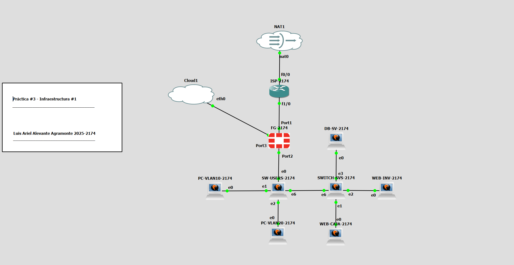

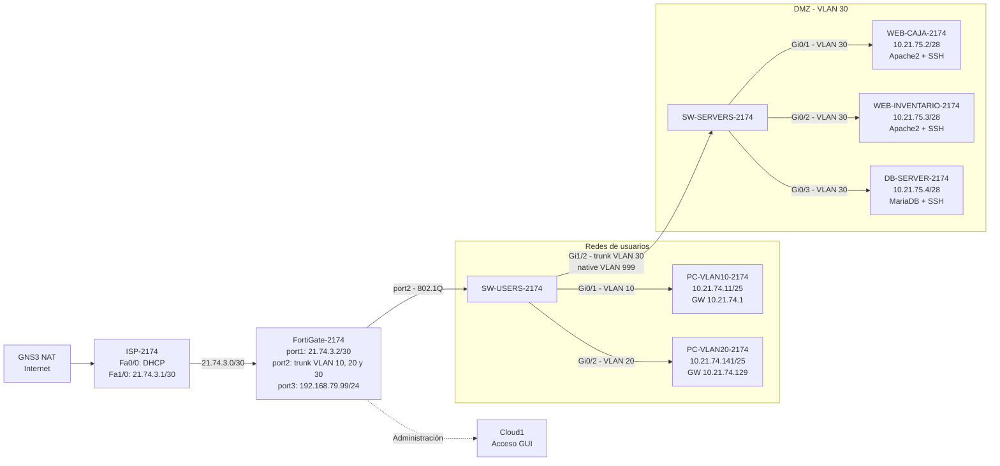

> El diagrama Mermaid representa la topología lógica. La captura superior muestra la implementación real en GNS3.

---

## 3. Plan de direccionamiento

| Equipo / segmento | Interfaz / función | Dirección |
|---|---|---|
| `ISP-2174` | Fa0/0 hacia GNS3 NAT | DHCP |
| `ISP-2174` | Fa1/0 hacia FortiGate | `21.74.3.1/30` |
| `FG-2174` | `WAN-ISP (port1)` | `21.74.3.2/30` |
| `FG-2174` | `VLAN10-USERS` | `10.21.74.1/25` |
| `PC-VLAN10-2174` | DHCP | `10.21.74.11/25` observado |
| `FG-2174` | `VLAN20-USERS` | `10.21.74.129/25` |
| `PC-VLAN20-2174` | DHCP | `10.21.74.141/25` observado |
| `FG-2174` | `VLAN30-DMZ` | `10.21.75.1/28` |
| `WEB-CAJA-2174` | ens3 | `10.21.75.2/28` |
| `WEB-INV-2174` | ens3 | `10.21.75.3/28` |
| `DB-SV-2174` | ens3 | `10.21.75.4/28` |
| `FG-2174` | port3 de administración | `192.168.79.99/24` |

**Pools DHCP**

- VLAN10: `10.21.74.10 - 10.21.74.100`
- VLAN20: `10.21.74.140 - 10.21.74.230`

Más detalle: [`docs/direccionamiento.md`](docs/direccionamiento.md)

---

## 4. Componentes del entorno

- **GNS3** + **GNS3 VM sobre VMware**
- **GNS3 NAT** para salida a Internet
- **Cisco IOS Router** como `ISP-2174`
- **FortiGate VM64-KVM / FortiOS 7.0.9** como firewall y gateway de VLANs
- **2 × Cisco IOSvL2**:
  - `SW-USERS-2174`
  - `SW-SERVERS-2174` — mostrado como `SWITCH-SVS-2174` en la topología de GNS3
- **2 × Ubuntu** como clientes de usuario
- **2 × Ubuntu + Apache2** como servidores web
- **1 × Ubuntu + MariaDB** como servidor de base de datos
- **OpenSSH Server** para administración de los servidores

---

## 5. Configuración implementada

### 5.1 ISP y NAT/PAT

`ISP-2174` utiliza `Fa0/0` como salida hacia GNS3 NAT y `Fa1/0` como enlace hacia el FortiGate.

- `Fa0/0`: dirección por DHCP, `ip nat outside`.
- `Fa1/0`: `21.74.3.1/30`, `ip nat inside`.
- PAT: `ip nat inside source list 1 interface FastEthernet0/0 overload`.
- La ACL 1 incluye la red `21.74.3.0/30`.

La validación muestra resolución de `google.com`, ping exitoso y traducciones activas de NAT/PAT.

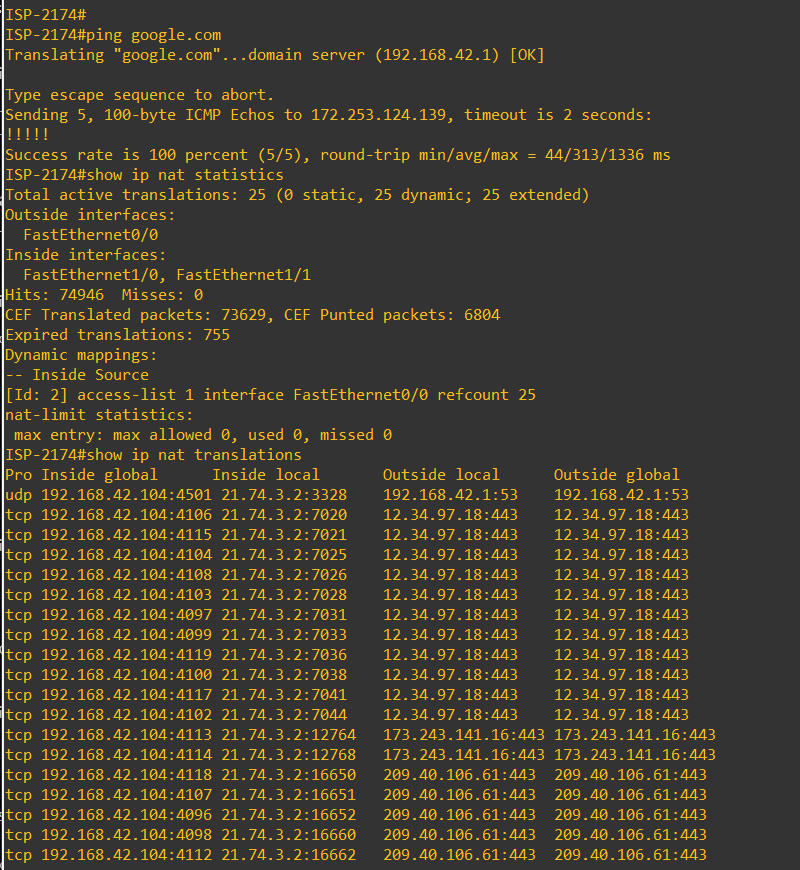

### 5.2 FortiGate, VLANs y DHCP

`port2` del FortiGate transporta las VLAN 10, 20 y 30 hacia `SW-USERS-2174`.

| VLAN | Nombre | Red | Gateway | Uso |
|---:|---|---|---|---|
| 10 | `VLAN10-USERS` | `10.21.74.0/25` | `10.21.74.1` | Usuarios con acceso restringido |
| 20 | `VLAN20-USERS` | `10.21.74.128/25` | `10.21.74.129` | Usuarios con SSH permitido hacia DMZ |
| 30 | `VLAN30-DMZ` | `10.21.75.0/28` | `10.21.75.1` | Servidores |
| 999 | `UNUSED_PORTS` | Sin gateway | — | Puertos no utilizados / native VLAN del trunk entre switches |

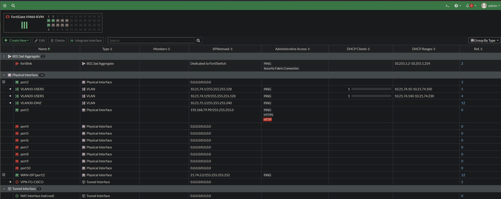

La ruta por defecto del FortiGate utiliza `21.74.3.1` por `port1`.

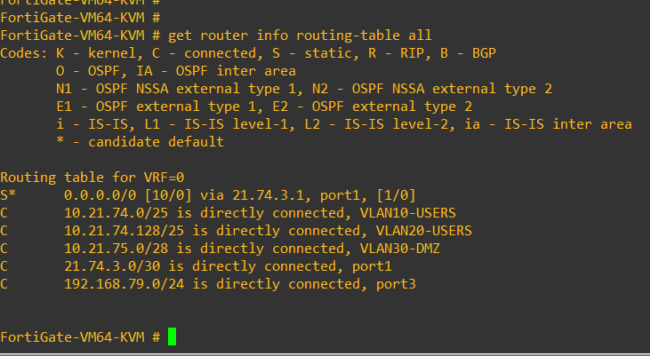

### 5.3 SW-USERS-2174

- `Gi0/0` → trunk hacia FortiGate, VLANs permitidas `10,20,30`.
- `Gi0/1` → access VLAN 10 hacia `PC-VLAN10-2174`.
- `Gi0/2` → access VLAN 20 hacia `PC-VLAN20-2174`.
- `Gi1/2` → trunk hacia `SW-SERVERS-2174`, solo VLAN 30, native VLAN 999.
- Puertos no utilizados → VLAN 999 + `shutdown`.
- Puertos de usuario → Port Security Sticky, máximo 1 MAC, acción `restrict`.
- PortFast Edge + BPDU Guard en puertos de acceso.

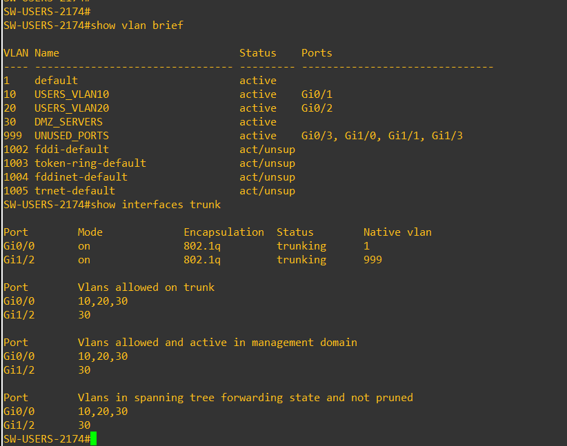

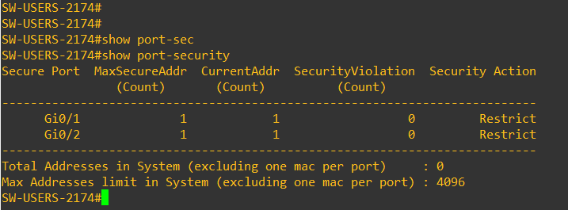

### 5.4 SW-SERVERS-2174

- `Gi1/2` → trunk hacia SW-USERS, VLAN 30 permitida, native VLAN 999.
- `Gi0/1` → `WEB-CAJA-2174`, access VLAN 30.
- `Gi0/2` → `WEB-INV-2174`, access VLAN 30.
- `Gi0/3` → `DB-SV-2174`, access VLAN 30.
- Puertos no utilizados → VLAN 999 + `shutdown`.
- Port Security Sticky, máximo 1 MAC, acción `restrict` en los tres puertos de servidor.
- PortFast Edge + BPDU Guard en puertos de acceso.

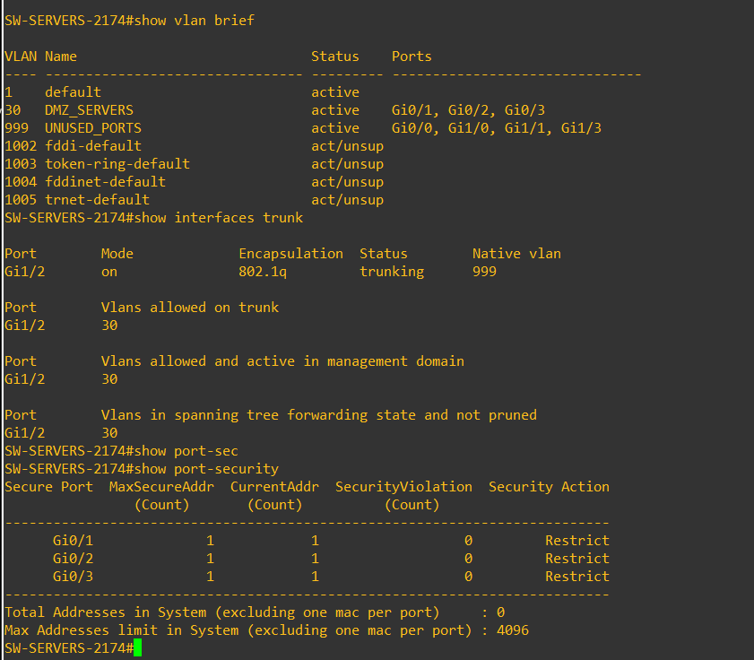

### 5.5 Políticas de FortiGate

| Política | Origen → destino | Servicio | Resultado |
|---|---|---|---|
| `BLOCK-VLAN10-SSH-DMZ` | VLAN10 → DMZ | SSH | **DENY** |
| `VLAN20-DMZ` | VLAN20 → DMZ | SSH | **ACCEPT** |
| `VLAN10-BLOCK-INVENTARIO` | VLAN10 → WEB-INVENTARIO | HTTP | ACCEPT + **Web Filter bloquea el destino** |
| `BLOCK-DMZ-TO-VLAN10` | DMZ → VLAN10 | ALL | **DENY** |
| `BLOCK-DMZ-TO-VLAN20` | DMZ → VLAN20 | ALL | **DENY** |
| `DMZ-DNS` | DMZ → DNS-SERVERS | DNS | **ACCEPT + NAT** |
| `DMZ-UBUNTU-UPDATES` | DMZ → Ubuntu endpoints | HTTP/HTTPS | **ACCEPT + NAT** |
| `BLOCK-DMZ-INTERNET` | DMZ → Internet | ALL | **DENY** |

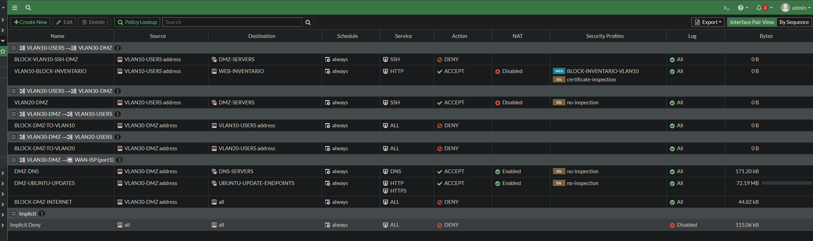

### 5.6 Objetos de FortiGate

Objetos principales utilizados:

- `WEB-CAJA` → `10.21.75.2/32`
- `WEB-INVENTARIO` → `10.21.75.3/32`
- `DB-SERVER` → `10.21.75.4/32`
- `DMZ-SERVERS` → grupo de los tres servidores
- `GOOGLE-DNS` → `8.8.8.8/32`
- `CLOUDFLARE-DNS` → `1.1.1.1/32`
- `DNS-SERVERS` → grupo de DNS permitidos
- `UBUNTU-ARCHIVE-IP` → `185.125.190.82/32`
- `UBUNTU-SECURITY-IP` → `91.189.91.83/32`
- `UBUNTU-UPDATE-ENDPOINTS` → grupo de endpoints permitidos

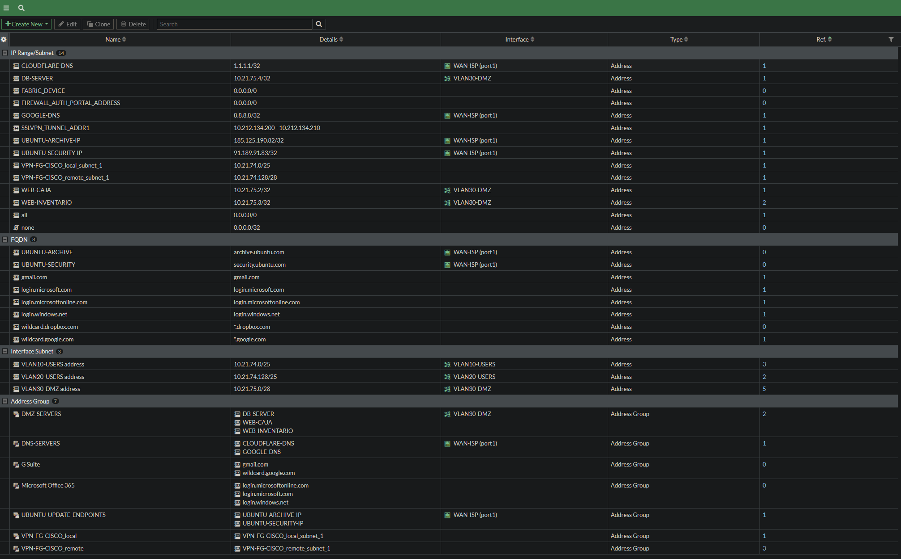

### 5.7 Web Filter para Inventario

La política `VLAN10-BLOCK-INVENTARIO` permite que el tráfico HTTP entre al motor UTM y aplica el perfil `BLOCK-INVENTARIO-VLAN10`. El filtro URL contiene `10.21.75.3` con acción **Block**.

La prueba desde VLAN10 devuelve:

```text
HTTP/1.1 403 Forbidden
```

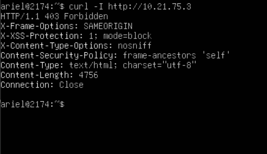

### 5.8 Servidores de la DMZ

| Servidor | IP | Servicios |
|---|---|---|
| `WEB-CAJA-2174` | `10.21.75.2/28` | Apache2, SSH |
| `WEB-INV-2174` | `10.21.75.3/28` | Apache2, SSH |
| `DB-SV-2174` | `10.21.75.4/28` | MariaDB, SSH |

Las páginas locales identifican los servicios **Cash Register System** e **Inventory System**.

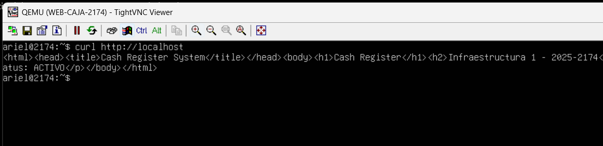

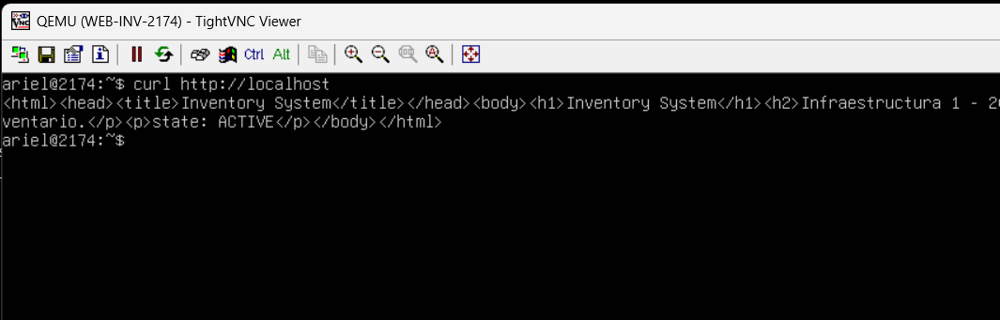

MariaDB utiliza la base `infraestructura1` y la tabla `productos`.

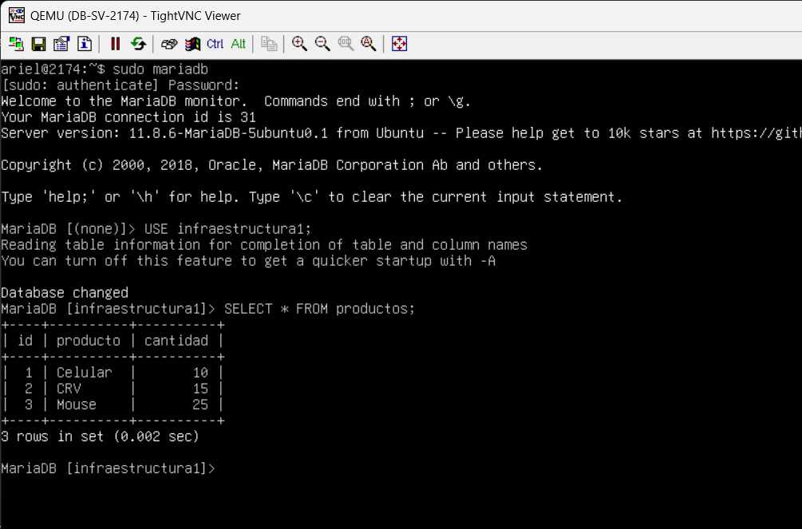

---

## 6. Validación

### 6.1 VLAN10 → SSH hacia DMZ bloqueado

```bash
ssh -o ConnectTimeout=5 ariel@10.21.75.2
```

Resultado observado: `Connection timed out`.

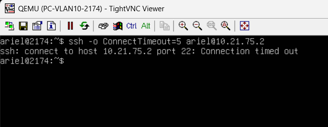

### 6.2 VLAN20 → SSH hacia DMZ permitido

Desde `PC-VLAN20-2174` se inicia sesión correctamente en `10.21.75.2`.

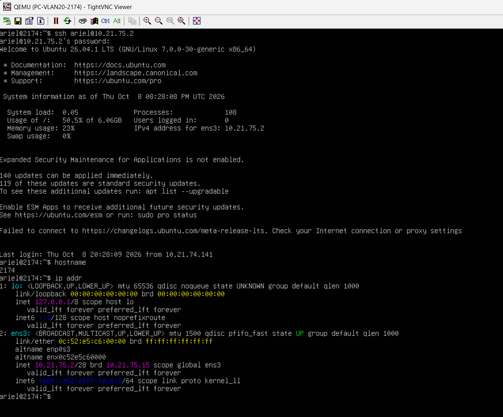

### 6.3 VLAN10 → Inventario bloqueado

```bash
curl -I http://10.21.75.3
```

Resultado: `HTTP/1.1 403 Forbidden`.


### 6.4 DMZ → redes de usuarios bloqueado

Desde `WEB-CAJA-2174`, las pruebas hacia `10.21.74.10` y `10.21.74.141` muestran **100% packet loss**.

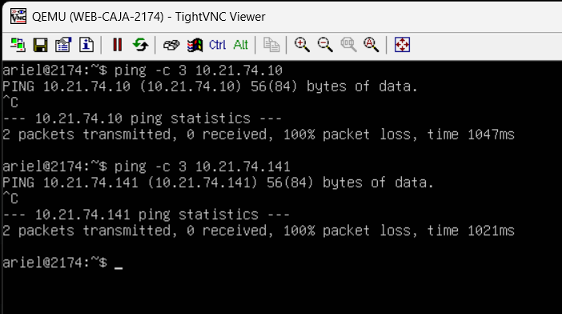

### 6.5 Actualizaciones permitidas, Internet general bloqueado

En `WEB-CAJA-2174`:

```bash
sudo apt update
curl -I --max-time 5 http://example.com
```

`apt update` alcanza `archive.ubuntu.com` y `security.ubuntu.com`, mientras que el `curl` a `example.com` expira. Esto confirma que la DMZ no tiene salida general a Internet.

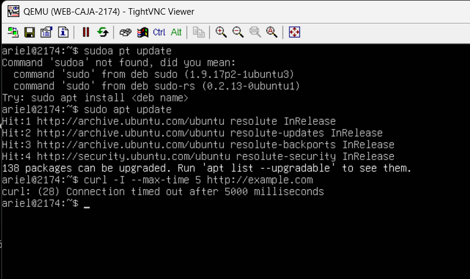

### 6.6 Servicios activos

Los tres servidores muestran los servicios requeridos en estado `active`:

- WEB-CAJA: `apache2` + `ssh`
- WEB-INVENTARIO: `apache2` + `ssh`
- DB-SERVER: `mariadb` + `ssh`

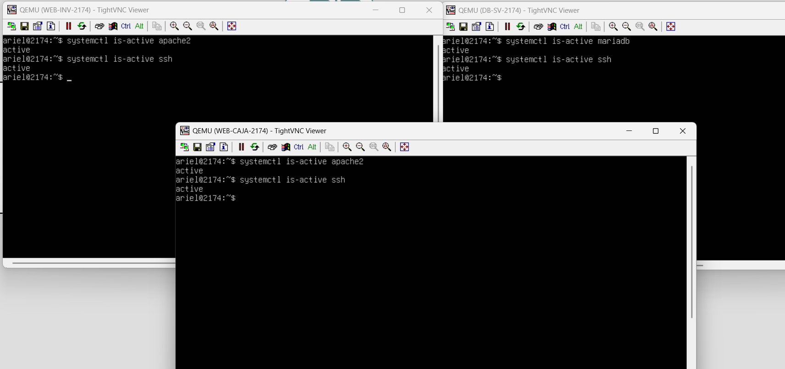

### 6.7 FortiGate con Internet y DNS

```text
execute ping 8.8.8.8
execute ping google.com
```

Ambas pruebas responden con **0% packet loss**.

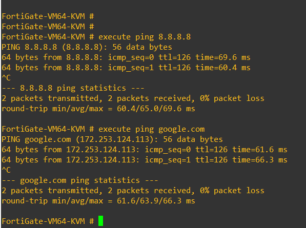

La secuencia completa está documentada en [`docs/validacion.md`](docs/validacion.md).

---

## 7. Evidencias principales

| Archivo | Qué demuestra |
|---|---|
| [`01-topologia-general.png`](evidencias/01-topologia-general.png) | Topología final de la práctica |
| [`02-sw-users-vlans-trunks.png`](evidencias/02-sw-users-vlans-trunks.png) | VLANs y trunks del switch de usuarios |
| [`03-sw-servers-port-security.png`](evidencias/03-sw-servers-port-security.png) | VLAN30, trunk y Port Security de servidores |
| [`04-fortigate-firewall-policies.png`](evidencias/04-fortigate-firewall-policies.png) | Conjunto final de políticas FortiGate |
| [`05-vlan10-ssh-bloqueado.png`](evidencias/05-vlan10-ssh-bloqueado.png) | SSH desde VLAN10 bloqueado |
| [`06-vlan20-ssh-permitido.png`](evidencias/06-vlan20-ssh-permitido.png) | SSH desde VLAN20 permitido |
| [`07-vlan10-inventario-bloqueado.png`](evidencias/07-vlan10-inventario-bloqueado.png) | Web Filter devuelve 403 al Inventario |
| [`08-dmz-updates-permitidos-internet-bloqueado.png`](evidencias/08-dmz-updates-permitidos-internet-bloqueado.png) | Ubuntu updates permitidos e Internet general bloqueado |
| [`09-dmz-usuarios-bloqueados.png`](evidencias/09-dmz-usuarios-bloqueados.png) | Aislamiento DMZ → VLAN10/VLAN20 |
| [`10-base-datos-mariadb.png`](evidencias/10-base-datos-mariadb.png) | MariaDB y tabla `productos` |
| [`11a-web-caja-apache.png`](evidencias/11a-web-caja-apache.png) | Página Apache de Caja |
| [`11b-web-inventario-apache.png`](evidencias/11b-web-inventario-apache.png) | Página Apache de Inventario |
| [`12-isp-nat-pat-internet.png`](evidencias/12-isp-nat-pat-internet.png) | Internet y traducciones NAT/PAT del ISP |
| [`13-sw-users-port-security.png`](evidencias/13-sw-users-port-security.png) | Port Security en los puertos de usuario |
| [`14-fortigate-interfaces-vlans.png`](evidencias/14-fortigate-interfaces-vlans.png) | Interfaces, VLANs y gateways FortiGate |
| [`15a-pc-vlan10-direccionamiento.png`](evidencias/15a-pc-vlan10-direccionamiento.png) | DHCP, IP y gateway de PC VLAN10 |
| [`15b-pc-vlan20-direccionamiento.png`](evidencias/15b-pc-vlan20-direccionamiento.png) | DHCP, IP y gateway de PC VLAN20 |
| [`16-fortigate-address-objects-groups.png`](evidencias/16-fortigate-address-objects-groups.png) | Objetos y grupos de direcciones |
| [`17-servicios-servidores-activos.png`](evidencias/17-servicios-servidores-activos.png) | Apache2, MariaDB y SSH activos |
| [`18a-sw-users-interface-status.png`](evidencias/18a-sw-users-interface-status.png) | Puertos activos y no usados de SW-USERS |
| [`18b-sw-servers-interface-status.png`](evidencias/18b-sw-servers-interface-status.png) | Puertos activos y no usados de SW-SERVERS |
| [`19-fortigate-routing-table.png`](evidencias/19-fortigate-routing-table.png) | Ruta por defecto y redes conectadas |
| [`20-fortigate-internet-dns.png`](evidencias/20-fortigate-internet-dns.png) | Conectividad IP y resolución DNS |

---

## 8. Running-configs

Las configuraciones están disponibles en [`running-configs/`](running-configs/):

- `FortiGate-2174.conf` — backup completo sanitizado.
- `FortiGate-2174-relevant.conf` — extracto depurado con la configuración específica de esta práctica.
- `ISP-2174.txt`
- `SW-USERS-2174.txt`
- `SW-SERVERS-2174.txt`

> **Seguridad:** las copias públicas fueron sanitizadas. Contraseñas, secretos y material criptográfico se reemplazaron por `<REDACTED>` cuando correspondía.

---

## 9. Comandos de validación

La carpeta [`scripts/`](scripts/) contiene los comandos usados para comprobar la práctica:

- [`comandos-validacion.txt`](scripts/comandos-validacion.txt)
- [`README.md`](scripts/README.md)

---

## 10. Resultado

La **Práctica #3 — Infraestructura #1** queda operativa con segmentación entre usuarios y servidores, controles de acceso diferenciados por VLAN y una DMZ restringida.

Las pruebas realizadas confirman que:

- VLAN10 no puede administrar los servidores por SSH;
- VLAN20 sí puede utilizar SSH hacia la DMZ;
- VLAN10 no puede acceder al servidor de inventario por HTTP;
- la DMZ no puede iniciar comunicación hacia las redes de usuarios;
- los servidores únicamente obtienen el acceso externo requerido para DNS y actualizaciones de Ubuntu;
- el resto del acceso a Internet desde la DMZ queda bloqueado;
- los dos switches aplican trunks, VLAN 999, Port Security y deshabilitación de puertos no utilizados;
- Apache2, MariaDB y SSH se mantienen activos en los servidores correspondientes;
- y el ISP realiza correctamente NAT/PAT hacia GNS3 NAT.

---

## 11. Notas operativas

- `Fa0/0` de `ISP-2174` recibe su dirección mediante DHCP desde GNS3 NAT, por lo que la IP externa puede cambiar entre reinicios.
- La salida de GNS3 depende del adaptador NAT de la GNS3 VM y del servicio NAT de VMware.
- El grupo `UBUNTU-UPDATE-ENDPOINTS` documentado en la configuración final utiliza los endpoints permitidos durante la validación de esta práctica.
- El backup completo de FortiGate contiene numerosos objetos predeterminados de FortiOS; para lectura rápida se incluye también `FortiGate-2174-relevant.conf`.

---

## Estructura del repositorio

```text
SR-PRACTICA-3-INFRAESTRUCTURA-1/
├── README.md
├── docs/
│   ├── direccionamiento.md
│   └── validacion.md
├── evidencias/
│   ├── 01-topologia-general.png
│   ├── 02-sw-users-vlans-trunks.png
│   ├── 03-sw-servers-port-security.png
│   ├── 04-fortigate-firewall-policies.png
│   ├── 05-vlan10-ssh-bloqueado.png
│   ├── 06-vlan20-ssh-permitido.png
│   ├── 07-vlan10-inventario-bloqueado.png
│   ├── 08-dmz-updates-permitidos-internet-bloqueado.png
│   ├── 09-dmz-usuarios-bloqueados.png
│   ├── 10-base-datos-mariadb.png
│   ├── 11a-web-caja-apache.png
│   ├── 11b-web-inventario-apache.png
│   ├── 12-isp-nat-pat-internet.png
│   ├── 13-sw-users-port-security.png
│   ├── 14-fortigate-interfaces-vlans.png
│   ├── 15a-pc-vlan10-direccionamiento.png
│   ├── 15b-pc-vlan20-direccionamiento.png
│   ├── 16-fortigate-address-objects-groups.png
│   ├── 17-servicios-servidores-activos.png
│   ├── 18a-sw-users-interface-status.png
│   ├── 18b-sw-servers-interface-status.png
│   ├── 19-fortigate-routing-table.png
│   └── 20-fortigate-internet-dns.png
├── running-configs/
│   ├── FortiGate-2174.conf
│   ├── FortiGate-2174-relevant.conf
│   ├── ISP-2174.txt
│   ├── SW-USERS-2174.txt
│   ├── SW-SERVERS-2174.txt
│   └── README.md
└── scripts/
    ├── comandos-validacion.txt
    └── README.md
```
